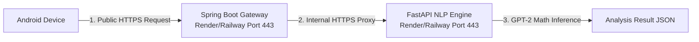

# TruthLens Production Deployment Plan

This guide outlines a comprehensive, production-grade deployment plan for the TruthLens backend services. Since the system comprises a **Spring Boot Gateway API** and a **FastAPI Python NLP Engine (running GPT-2)**, we will leverage containerization (Docker) and cost-effective cloud platforms (Render, Railway, or AWS) for an effortless deploy.

---

## 🗺️ Deployed System Topology

When fully deployed, the communication path will look like this:



---

## 🚀 Step 1: Deploy the FastAPI Python NLP Engine (Port 5000)

The NLP Engine uses FastAPI, PyTorch, and Hugging Face Transformers (GPT-2 model). Because of its dependencies (PyTorch is ~700MB, GPT-2 model is ~500MB), **using Docker is the most reliable way** to deploy to a Linux cloud container.

### 1. Add `Dockerfile` to the `python-nlp` folder
Create a file named [Dockerfile](file:///c:/Users/Zainab/OneDrive/Documents/Desktop/ZDesktop/TruthLens/python-nlp/Dockerfile) inside your `python-nlp` directory:

```dockerfile
# Use a lightweight official Python image
FROM python:3.11-slim

# Set environment variables
ENV PYTHONDONTWRITEBYTECODE=1
ENV PYTHONUNBUFFERED=1
ENV PORT=5000

# Install build essential tools for compiled python libraries
RUN apt-get update && apt-get install -y --no-install-recommends \
    build-essential \
    && rm -rf /var/lib/apt/lists/*

# Set working directory
WORKDIR /app

# Copy dependency list
COPY requirements.txt .

# Install dependencies with light CPU-only PyTorch to reduce image size significantly
RUN pip install --no-cache-dir -r requirements.txt

# Copy the rest of the application
COPY . .

# Expose port
EXPOSE 5000

# Command to run FastAPI server
CMD uvicorn main:app --host 0.0.0.0 --port 5000
```

> [!TIP]
> **RAM Optimization**: By default, PyTorch downloads both CUDA (GPU) and CPU binaries. Since our cloud web-tier uses CPU, the docker image can be optimized. If you run out of memory or disk limits on a free cloud tier, update your `requirements.txt` to install the CPU-specific PyTorch build, or choose a cloud tier with **at least 2GB of RAM**.

### 2. Choose a Cloud Provider
*   **Render (Recommended - Web Service Tier)**: High reliability, direct GitHub integration, automatically builds and executes the `Dockerfile`.
*   **Railway (Excellent)**: Instant deploys, extremely fast build servers, and supports Docker natively.

### 3. Deploy Steps
1. Push your repository to Github.
2. Log in to **Render** or **Railway**.
3. Create a **New Web Service** and select your GitHub repository.
4. Set the **Root Directory** to `python-nlp`.
5. The cloud provider will automatically detect the `Dockerfile`, build it, and launch your API.
6. **Note down your Deployed URL** (e.g., `https://truthlens-nlp.onrender.com`).

---

## ☕ Step 2: Deploy the Spring Boot Gateway (Port 8080)

The Spring Boot backend acts as a gateway and forwards incoming requests to the Python engine. It requires Java 21.

### 1. Add `Dockerfile` to the `Springboot-backend` folder
Create a file named [Dockerfile](file:///c:/Users/Zainab/OneDrive/Documents/Desktop/ZDesktop/TruthLens/Springboot-backend/Dockerfile) inside your `Springboot-backend` directory:

```dockerfile
# Stage 1: Build the Maven application
FROM maven:3.9-eclipse-temurin-21 AS build
WORKDIR /app
COPY pom.xml .
COPY src ./src
RUN mvn clean package -DskipTests

# Stage 2: Create a lightweight runtime image
FROM eclipse-temurin:21-jre-jammy
WORKDIR /app
COPY --from=build /app/target/truthlens-backend-1.0.0.jar app.jar

# Expose port
EXPOSE 8080

# Run JVM with environment variables mapped to properties
ENTRYPOINT ["java", "-Dnlp.api.url=${NLP_API_URL}", "-jar", "app.jar"]
```

### 2. Deploy Steps
1. Create a **New Web Service** on Render or Railway.
2. Select your GitHub repository.
3. Set the **Root Directory** to `Springboot-backend`.
4. In the **Environment Variables / Config** section of the cloud dashboard, add:
   - **Key**: `NLP_API_URL`
   - **Value**: `https://truthlens-nlp.onrender.com` (Your deployed Python URL from Step 1)
5. Save and deploy.
6. **Note down your Deployed Spring Boot URL** (e.g., `https://truthlens-api.onrender.com`).

---

## 📱 Step 3: Update the Android App & Build Release APK

Now that both backends are running securely in the cloud, you can release your production APK!

### 1. Set the Default Production Server URL
Open [RetrofitClient.java](file:///c:/Users/Zainab/OneDrive/Documents/Desktop/ZDesktop/TruthLens/android-app/app/src/main/java/com/truthlens/api/RetrofitClient.java) and change `DEFAULT_URL` to point to your newly deployed Spring Boot API:
```java
// Production Cloud URL
private static final String DEFAULT_URL = "https://truthlens-api.onrender.com/";
```

### 2. Build the Production Release APK
In Android Studio:
1. Go to **Build** > **Generate Signed Bundle / APK...**
2. Select **APK** and click **Next**.
3. Create or select your **Key Store** credentials.
4. Select the **Release** build variant.
5. Click **Create**.

Your final compiled `.apk` is ready! 
- Anyone who downloads this APK will automatically connect to your production cloud backend out of the box.
- Thanks to our runtime configuration panel, you can still easily override the URL inside the app at any time for custom testing or staging servers.

---

## 🛡️ Production Recommendations & Best Practices

> [!WARNING]
> **Cloud Tier Cold Starts (Render / Railway)**: If you use the free/hobby tiers on Render, your web service will automatically "spin down" after 15 minutes of inactivity. The next incoming request will cause a "cold start" (taking 1-2 minutes to download container files, load PyTorch, and spin up). For production distribution, consider upgrading to a **$7/month paid instance** to keep the services alive 24/7.

> [!IMPORTANT]
> **API Security**: Right now, the endpoints are open. Before releasing to a large audience, add basic API Key validation header checks or OAuth between the Android client, the Spring Boot Gateway, and the FastAPI engine to prevent unauthorized usage of your server.
